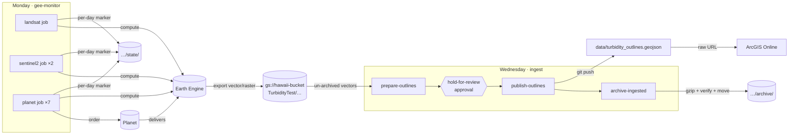

# akk_satellite_turbidity

Satellite-detected turbidity event outlines along the West Hawaiʻi coast for the
[Akoakoa](https://github.com/ASU-GDCS) geoportal.

Every week:

1. **Monday: `gee-monitor`.** Google Earth Engine compares new Landsat 8/9, Sentinel-2 and
   PlanetScope imagery with 2023 baselines, outlines likely turbidity events, and exports
   per-day vector and raster files to `gs://hawaii-bucket/TurbidityTest/`.
2. **Wednesday: `ingest`.** The new vector files are collected, unioned per satellite and
   date, and filtered by size. You review them on a map, and after you approve they're
   appended to [`data/turbidity_outlines.geojson`](data/turbidity_outlines.geojson). ArcGIS
   Online (AGOL) reads that file straight from GitHub. The source files are then gzipped
   into an archive prefix in the bucket.

Both run on CircleCI. **This repository contains no credentials.** Google access is
keyless (OIDC + Workload Identity Federation), and the only secret, the Planet API key,
lives in a restricted CircleCI context.



---

## Contents

- [How it works](#how-it-works)
- [Repository layout](#repository-layout)
- [Secrets and identities](#secrets-and-identities)
- [One-time setup](#one-time-setup)
  - [1. GitHub](#1-github)
  - [2. Google Cloud (keyless access)](#2-google-cloud-keyless-access)
  - [3. CircleCI](#3-circleci)
  - [4. ArcGIS Online](#4-arcgis-online)
  - [5. Cut over from the old systemd service](#5-cut-over-from-the-old-systemd-service)
- [Weekly operation](#weekly-operation)
- [Layer history](#layer-history)
- [Common tasks](#common-tasks)
- [Local development](#local-development)
- [Troubleshooting](#troubleshooting)
- [Credits](#credits)

---

## How it works

### `gee-monitor` (Mondays)

`akk-monitor --satellite <landsat|sentinel2|planet>` runs once per satellite as three
CircleCI jobs. Each job uses `parallelism` to spread its days across several machines.

- **Which days get processed.** Each satellite processes every day in
  `[max(processed_through + 1, today − lookback_days), today − lag_days]` that has no
  **state marker**. A marker is the object
  `gs://hawaii-bucket/TurbidityTest/state/<satellite>/<YYYY-MM-DD>.json`. It's written
  when a day finishes, including days with no imagery. A failed or timed-out day has no
  marker, so the next run retries it automatically. The lags are 8 days for Landsat,
  5 for Sentinel-2 and 1 for Planet, matching when imagery becomes available. All of
  these settings are in [`config/pipeline.toml`](config/pipeline.toml).
- **Time limits.** Days are independent, so they're split round-robin across the job's
  parallel nodes. A node stops starting new days after `time_budget_minutes` (40), which
  keeps it under CircleCI's job limit (1 h on the Free plan). Anything left over is
  picked up by the next run.
- **Planet.** For each day, Planet is searched first. If there are no scenes, the day is
  recorded as done with 0 images. The old code placed an empty order, got
  `ItemIDs is empty`, and stalled. Otherwise an order is placed and delivered straight
  into the Earth Engine collection `imagery/planet/daily_test_17May/<date>`, processed,
  and cleaned up.
- **Export failures.** A failed export fails the day, and the day is retried. The old
  code printed export failures and marked the day as done anyway.

### `ingest` (Wednesdays)

1. **`prepare-outlines`**
   - Lists every `TurbidityTest/<sat>/<YYYY>/vector/<date>.geojson` that is still in
     place. Ingested files get archived, so anything still there hasn't been ingested.
   - Converts them to the published schema (`Satelite, ID, Date, PixelCount, Area_ha`)
     and unions outlines per satellite and date, using the same logic and filters as the
     original `combine_by_date.py`.
   - Appends them to a copy of the layer. A satellite/date pair already in the layer, or
     listed in [`config/exclusions.txt`](config/exclusions.txt), is never added.
   - Saves review artifacts: `summary.md`, `map.html` and `new_outlines.geojson`, plus
     `manifest.json`, the exact generation and MD5 of every source file.
2. **`hold-for-review`.** The workflow pauses until someone clicks **Approve**.
3. **`publish-outlines`** commits the candidate layer to `main` using a write deploy key.
   It refuses if the layer changed since `prepare`.
4. **`archive-ingested`** handles each file in the manifest:
   1. Downloads the reviewed generation and checks its MD5.
   2. Writes `TurbidityTest/archive/<sat>/<YYYY>/vector/<date>.geojson.gz`. It never
      overwrites an existing archive object.
   3. Reads that copy back, decompresses it and compares the MD5.
   4. Only then deletes the original, and only if it is still the same generation.

   Rasters are never touched. Re-running this job is safe.

Ingesting "whatever hasn't been archived yet" replaces the old date-window bookkeeping,
which had a bug. Landsat and Sentinel-2 outlines are exported 5–8 days after the
acquisition date. Any that arrived after an ingest, but were dated before it, were
**never collected**. For example, Sentinel-2 on 2026-02-01 and 2026-02-04 was exported
on 02-14, after the 02-05 ingest. The first ingest run offers those as **backfill**.

## Repository layout

```
.circleci/config.yml           all pipelines (selected by the `run` pipeline parameter)
ci/gcp_wif_login.sh            writes the keyless Google credential config for a job
ci/oidc_token.sh               hands google-auth a fresh CircleCI OIDC token
ci/push_layer.sh               commits the approved layer with the deploy key
config/pipeline.toml           non-secret settings: bucket, prefixes, assets, lags, cut-over dates
config/exclusions.txt          satellite/date outlines never to publish
config/*.geojson               ROI / AOI geometries
data/turbidity_outlines.geojson  THE published layer (AGOL reads this)
src/akk_turbidity/
  monitor/                     Earth Engine processing per satellite (ported from the original repo)
  run_monitor.py               akk-monitor: day scheduling, state markers, time budget
  state.py                     per-day GCS markers
  ingest/                      akk-ingest: collect, combine, review, apply, archive
  auth.py                      credentials (Application Default Credentials) + akk-auth-check
tools/order_planet_baseline.py one-off: order Planet imagery into EE (baseline building)
tests/                         offline tests (fake GCS); run in CI on every push
```

## Secrets and identities

Nothing sensitive is committed. Every push runs [gitleaks](https://github.com/gitleaks/gitleaks)
over the full history, using the default rules plus rules for Planet keys and
base64/JSON service-account keys; see [`.gitleaks.toml`](.gitleaks.toml).

Everything the jobs need comes from the CircleCI context **`akk-turbidity`**:

| Variable | Secret? | What it is |
|---|---|---|
| `PLANET_API_KEY` | **yes** | Planet API key used to order daily PlanetScope scenes. |
| `GCP_WIF_PROVIDER` | no | `projects/<PROJECT_NUMBER>/locations/global/workloadIdentityPools/circleci/providers/circleci-akk` |
| `CIRCLECI_OIDC_AUDIENCE` | no | Your CircleCI **organization ID**, used as the token audience. |
| `GEE_SERVICE_ACCOUNT` | no | Service account the Monday jobs act as. It runs Earth Engine and writes exports and state markers. |
| `INGEST_SERVICE_ACCOUNT` | no | Service account the Wednesday jobs act as. It reads, writes and deletes under `TurbidityTest/` in the bucket. |

The only other credential is the **GitHub deploy key** (write access to this repository
only). Its private half is stored in CircleCI's project SSH keys.

There are no Google key files anywhere. CircleCI issues each job a short-lived OIDC
token. Google STS exchanges it, and only if the token comes from **this CircleCI
project** and the **`main` branch**, for a one-hour token of the service account.

## One-time setup

You need admin on the GitHub org, owner or IAM admin on the Google Cloud projects
involved, and admin on the CircleCI org.

### 1. GitHub

1. **Create the repository**, private at first, and push:
   ```bash
   gh repo create ASU-GDCS/akk_satellite_turbidity --private --source . --push
   ```
   Switch it to public only after the whole pipeline has run end to end (step 5):
   **Settings → General → Danger Zone → Change visibility**.
2. **Secret scanning:** go to **Settings → Code security** and enable *Secret Protection*
   and *Push protection*. Both are free on public repositories.
3. **Deploy key** that CircleCI uses to push the approved layer:
   ```bash
   ssh-keygen -t ed25519 -N "" -C "circleci akk_satellite_turbidity" -f ./akk_deploy_key
   ```
   - In GitHub: **Settings → Deploy keys → Add deploy key**. Paste `akk_deploy_key.pub`
     and tick **Allow write access**.
   - In CircleCI (step 3.4), add the private `akk_deploy_key`.
   - Then delete both local files: `shred -u akk_deploy_key akk_deploy_key.pub`.
4. **Protect `main`:** go to **Settings → Rules → New branch ruleset** targeting `main`.
   Block force pushes and deletions. If you also *Require a pull request*, add
   **Deploy keys** to the ruleset's bypass list so the bot can still push.

### 2. Google Cloud (keyless access)

The identity pool lives in the Earth Engine project. You need the CircleCI **organization
ID** and **project ID** (step 3.2) first.

```bash
PROJECT_ID=akoakoa-turbidity
PROJECT_NUMBER=$(gcloud projects describe "$PROJECT_ID" --format='value(projectNumber)')
CIRCLECI_ORG_ID=<organization id>          # CircleCI Organization Settings > Overview
CIRCLECI_PROJECT_ID=<project id>           # CircleCI Project Settings > Overview
POOL=circleci
PROVIDER=circleci-akk
GEE_SA=akoakoa-turbidity@${PROJECT_ID}.iam.gserviceaccount.com   # existing Earth Engine service account
INGEST_SA=turbidity-ingest@${PROJECT_ID}.iam.gserviceaccount.com
BUCKET=hawaii-bucket

gcloud services enable iam.googleapis.com iamcredentials.googleapis.com sts.googleapis.com \
  --project "$PROJECT_ID"

# Identity pool + CircleCI OIDC provider (only this CircleCI project, only main)
gcloud iam workload-identity-pools create "$POOL" --project "$PROJECT_ID" \
  --location global --display-name "CircleCI"
gcloud iam workload-identity-pools providers create-oidc "$PROVIDER" --project "$PROJECT_ID" \
  --location global --workload-identity-pool "$POOL" \
  --issuer-uri "https://oidc.circleci.com/org/${CIRCLECI_ORG_ID}" \
  --allowed-audiences "${CIRCLECI_ORG_ID}" \
  --attribute-mapping "google.subject=assertion['oidc.circleci.com/project-id'],attribute.project_id=assertion['oidc.circleci.com/project-id'],attribute.vcs_ref=assertion['oidc.circleci.com/vcs-ref']" \
  --attribute-condition "assertion['oidc.circleci.com/project-id'] == '${CIRCLECI_PROJECT_ID}' && assertion['oidc.circleci.com/vcs-ref'] == 'refs/heads/main'"

MEMBER="principalSet://iam.googleapis.com/projects/${PROJECT_NUMBER}/locations/global/workloadIdentityPools/${POOL}/attribute.project_id/${CIRCLECI_PROJECT_ID}"

# Dedicated service account for the ingest/archive jobs
gcloud iam service-accounts create turbidity-ingest --project "$PROJECT_ID" \
  --display-name "akk turbidity ingest (CircleCI)"

# Let CircleCI jobs impersonate both service accounts
for SA in "$GEE_SA" "$INGEST_SA"; do
  gcloud iam service-accounts add-iam-policy-binding "$SA" --project "$PROJECT_ID" \
    --role roles/iam.workloadIdentityUser --member "$MEMBER"
done
```

**Bucket access.** This is done by whoever administers `hawaii-bucket`, which may be in
a different project. Both service accounts need object read, write and delete under
`TurbidityTest/`. The GEE account already writes the exports; it now also writes the
state markers.

If the bucket uses uniform bucket-level access, limit the grant to the prefix:

```bash
# --condition splits on commas, so the expression goes in a file
cat > /tmp/turbidity-cond.yaml <<EOF
title: TurbidityTest-only
description: Only objects under TurbidityTest/
expression: 'resource.name.startsWith("projects/_/buckets/${BUCKET}/objects/TurbidityTest/") || api.getAttribute("storage.googleapis.com/objectListPrefix", "").startsWith("TurbidityTest/")'
EOF
for SA in "$GEE_SA" "$INGEST_SA"; do
  gcloud storage buckets add-iam-policy-binding "gs://$BUCKET" \
    --member "serviceAccount:$SA" --role roles/storage.objectUser \
    --condition-from-file /tmp/turbidity-cond.yaml
done
```

To check whether the bucket uses uniform access, run
`gcloud storage buckets describe "gs://$BUCKET" --format="value(uniform_bucket_level_access)"`.
Without uniform access, conditions aren't available, so grant `roles/storage.objectUser`
on the bucket without `--condition-from-file`.

**Earth Engine:** nothing changes. The existing GEE service account is already registered and has
Earth Engine access in the project. Only the way the jobs authenticate as it changes.

### 3. CircleCI

1. **Add the project:** go to **Projects → Set Up Project → ASU-GDCS/akk_satellite_turbidity**
   and choose *use existing config* (`.circleci/config.yml`, branch `main`).
2. **Note the IDs** you need for step 2:
   - the organization ID, from **Organization Settings → Overview**;
   - the project ID, from **Project Settings → Overview**.
3. **Context:** go to **Organization Settings → Contexts → Create Context** and name it
   `akk-turbidity`.
   - Add the five variables from [Secrets and identities](#secrets-and-identities).
   - Under **Project restrictions**, allow only this project.
   - Under **Expression restrictions**, add `pipeline.git.branch == "main"`.
   - If your org offers security groups for contexts (GitHub OAuth orgs), limit the
     context to the people allowed to approve publishing. The jobs after the approval
     use this context, so in practice only those people can approve.
4. **Deploy key:** go to **Project Settings → SSH Keys → Additional SSH Keys → Add SSH Key**.
   Set the hostname to `github.com` and paste the private `akk_deploy_key` from step 1.3.
5. **Forked PRs:** go to **Project Settings → Advanced**.
   - Turn **off** *Pass secrets to builds from forked pull requests*.
   - Turn **off** *Build forked pull requests*. If you want fork PRs checked, you can
     leave it on, because the `checks` job uses no context.
   - Build logs and artifacts of a public project are public. Nothing in them is
     sensitive, and context values are masked in logs.
6. **Schedules:** go to **Project Settings → Triggers** (or **Pipelines → Schedule
   triggers**). Schedules are in UTC.

   | Name | Timetable | Branch | Pipeline parameter |
   |---|---|---|---|
   | `gee-monitor-weekly` | Mondays 13:00 UTC (03:00 HST) | `main` | `run` = `gee-monitor` |
   | `ingest-weekly` | Wednesdays 18:00 UTC (08:00 HST) | `main` | `run` = `ingest` |

   Leave the push trigger in place. With no parameter it runs `checks`.
7. **Notifications:** in **User Settings → Notifications**, enable email for failed
   workflows and for workflows awaiting approval, if your plan offers it. CircleCI's
   failure emails replace the old `mail` alerts.
8. **Test access:** go to **Trigger Pipeline** on `main`, add the parameter
   `run` = `auth-check` and run it. Both steps must print `OK`.

### 4. ArcGIS Online

The layer's public URL is:

```
https://raw.githubusercontent.com/ASU-GDCS/akk_satellite_turbidity/main/data/turbidity_outlines.geojson
```

In AGOL, go to **Content → New item → URL**, paste the URL, and choose type **GeoJSON**.
Map Viewer reads the file live, so new outlines appear after the Wednesday approval.
GitHub's cache delays this by up to about 5 minutes.

If you need a *hosted* feature layer instead, for heavier symbology or queries, you have
to overwrite it from the URL after each update.

The file is about 18 MB and grows by roughly 1 MB a month. GitHub's per-file limit is
100 MB.

### 5. Cut over from the old systemd service

Do these steps in order so that no day is processed twice or skipped.

1. On phx-login02, stop the old timer:
   ```bash
   systemctl --user disable --now turbidity_monitor.timer
   ```
2. Copy the last processed dates from the old `config/app.config` (`[timestamps]`) into
   `processed_through` in `config/pipeline.toml`, then commit. Nothing on or before
   those dates is reprocessed.
3. Run `auth-check`, then trigger `run` = `gee-monitor` by hand. Check that the day
   markers appear under `TurbidityTest/state/`.
4. Trigger `run` = `ingest` by hand and review the first update.
   - It lists every vector file ever exported. Files already in the layer show as
     `duplicate` and are only archived.
   - Outlines the old process missed show as **backfill**.
   - If any of those were deliberately left out of the layer before, add them to
     `config/exclusions.txt`, commit, and re-run the ingest.
   - Then approve.
5. Point AGOL at the raw URL (step 4). Once a normal week has run, switch the repository
   to public.
6. Retire the old credentials. They're no longer needed, and some were exposed:
   ```bash
   gcloud iam service-accounts keys list --iam-account "$GEE_SA"
   gcloud iam service-accounts keys delete <KEY_ID> --iam-account "$GEE_SA"   # every user-managed key
   # and the old bucket-access key that update_outlines.sh used
   ```
   Also rotate the Planet key if it was ever stored in the old repository.

## Weekly operation

**On Monday,** check that the `gee-monitor` workflow is green.
- The log ends with a per-day summary: `done`, `failed` or `deferred`.
- `failed` and `deferred` days are retried next week automatically.
- A day that keeps failing for longer than `lookback_days` (30) is dropped from the
  schedule. Fix it and run it by hand (see [Common tasks](#common-tasks)).

**On Wednesday,** open the `ingest` workflow:
1. Go to `prepare-outlines` → **Artifacts** → `review/map.html`. New outlines are
   coloured by satellite, recent layer outlines are grey, and the side list zooms to
   each date. `review/summary.md` has the table, and the same text is in the job log.
2. If it looks right, click **Approve** on `hold-for-review`. The layer is committed
   and the source files are archived.
3. If it doesn't, **Cancel** the workflow. Nothing changes and the files stay in place.
   To drop specific false positives for good, add `<YYYY-MM-DD> <Satelite>` lines to
   `config/exclusions.txt`. Then **Trigger Pipeline** with `run` = `ingest` again.

## Layer history

Every published version of the layer is a commit that touches
`data/turbidity_outlines.geojson`:

```bash
git log --format='%ad %s' --date=short -- data/turbidity_outlines.geojson
git show <commit>:data/turbidity_outlines.geojson > layer-at-that-time.geojson
```

- **Updates up to 2026-08-09** came from the manual process. They were imported from
  its dated snapshots, and each commit carries the date that snapshot was made.
  - Early 2024 updates were reprocessed several times, so feature counts go down as
    well as up.
  - A few updates added nothing and only shifted coordinates slightly, because the old
    process re-unioned everything on every run.
- **Later updates** are the approved `ingest` commits. Each one links to its CircleCI
  review.

The layer is written one feature per line, so `git diff` shows exactly which outlines
an update added.

## Common tasks

**Re-run a satellite day.** Delete its marker and trigger `gee-monitor`:

```bash
gcloud storage rm gs://hawaii-bucket/TurbidityTest/state/sentinel2/2026-10-01.json
```

If that satellite/date is already in the layer, first remove its features from
`data/turbidity_outlines.geojson` in a commit. Otherwise the ingest treats the new
export as a duplicate.

**Restore an archived export:**

```bash
gcloud storage cat gs://hawaii-bucket/TurbidityTest/archive/planet/2026/vector/2026-09-22.geojson.gz | gunzip > 2026-09-22.geojson
```

Each archive object keeps the original name, generation and MD5 in its metadata.

**Order baseline Planet imagery** (one-off):
`PLANET_API_KEY=... uv run python tools/order_planet_baseline.py -h`

**Change schedule, lags or look-back:** edit `config/pipeline.toml`. Parallelism per
satellite is set in `.circleci/config.yml` (`nodes:`).

## Local development

You need [uv](https://docs.astral.sh/uv/). There's no conda environment any more.

```bash
uv sync                       # creates .venv from uv.lock (Python 3.12)
uv run pytest                 # offline tests

# See what the monitor would do. Reads the public bucket anonymously; no credentials needed.
uv run akk-monitor --satellite planet --dry-run --anonymous

# Build a review locally from the live bucket (read-only, anonymous)
uv run akk-ingest prepare --anonymous --out build/ingest
xdg-open build/ingest/review/map.html
```

For anything that talks to Earth Engine or writes to the bucket, impersonate the service
account through Application Default Credentials. Your Google account needs
`roles/iam.serviceAccountTokenCreator` on that service account.

```bash
gcloud auth application-default login \
  --impersonate-service-account <GEE service account email>
uv run akk-auth-check --ee --gcs
PLANET_API_KEY=... uv run akk-monitor --satellite sentinel2 --days 2026-10-01
```

Install the secret-scanning pre-commit hook: `uvx pre-commit install`.

## Troubleshooting

| Symptom | Likely cause |
|---|---|
| `invalid_target` / `The target service indicated by the "audience"…` | `GCP_WIF_PROVIDER` is wrong, or the pool or provider is disabled. |
| `The given credential is rejected by the attribute condition` | The run isn't on `main`, or the project ID in the provider condition is wrong. |
| `Permission 'iam.serviceAccounts.getAccessToken' denied` | The `workloadIdentityUser` binding for that service account is missing (step 2). |
| `No CircleCI OIDC token: the job must use a context` | The job lacks `context: akk-turbidity`, or the context restrictions blocked it. |
| Earth Engine `not registered` / `permission denied` | The GEE service account lost Earth Engine access in `akoakoa-turbidity`. |
| A job hits CircleCI's time limit | Raise `nodes:` for that satellite, or lower `time_budget_minutes`. Unfinished days are retried. |
| `publish-outlines`: layer changed since this update was prepared | Someone committed to the layer after `prepare`. Re-run the ingest. |
| `publish-outlines`: expected exactly one additional SSH key | The deploy key is missing from CircleCI (step 3.4). |
| Archive job failed part-way | Safe to **Rerun**. Finished files are recognised, and nothing is deleted without a verified copy. |

## Credits

The Earth Engine processing and the outline collection scripts were written in the
original (private) `ASU-GDCS/akoakoa_turbidity` repository by Marcel König, Nick Vaughn
and colleagues at the ASU Center for Global Discovery and Conservation Science. The Planet
ordering tool builds on work by Manthan Satish (Kerner Lab) and Planet's example notebooks.

Licensed under the [Apache License 2.0](LICENSE).
